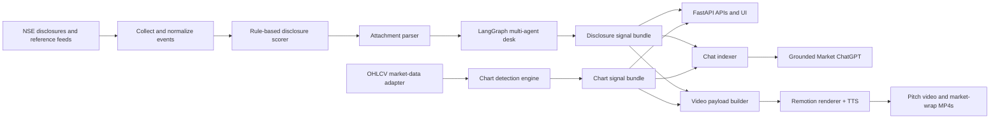

# Architecture Document

## Overview

Investor-ai is built as one market-intelligence layer that powers four product
surfaces:

1. `Opportunity Radar`
2. `Chart Pattern Intelligence`
3. `Market ChatGPT`
4. `AI Market Video Engine`

The design deliberately keeps deterministic logic where precision matters and
agentic reasoning where judgment matters.

## System Diagram

## Agent Roles

The disclosure lane is the agentic core of the system.

- `Scout`: gathers the market universe from the normalized event stream.
- `Router`: prioritizes the strongest signals to keep the expensive review path focused.
- `Filing Analyst`: converts the filing and parsed attachment evidence into a structured brief.
- `Bull Analyst`: argues the upside case from the same evidence.
- `Bear Analyst`: argues the risk case from the same evidence.
- `Referee`: weighs both sides and produces the final publishable verdict.

This workflow is implemented in LangGraph so the reasoning path is explicit,
role-based, and auditable rather than a single opaque prompt.

## Core Integrations

- `NSE / exchange feeds`: disclosures, insider trades, bulk deals, and reference data.
- `OHLCV provider adapter`: historical and intraday candle data used by the chart engine.
- `OpenAI models`: explanations, grounded chat answers, and narration audio.
- `Remotion`: programmatic video rendering for the daily wrap and the 3-minute pitch demo.
- `FastAPI`: API layer and app shell for radar, chart, chat, and video surfaces.

## Data Flow By Product

### Opportunity Radar

1. Collect and normalize exchange events.
2. Score events with deterministic signal logic.
3. Parse top filing attachments.
4. Run the multi-agent review graph.
5. Publish ranked investor-facing alerts.

### Chart Pattern Intelligence

1. Pull candle history for the NSE universe.
2. Compute indicators, pivots, and support/resistance zones.
3. Detect breakouts, reversals, divergences, and rejection setups.
4. Backtest pattern performance per stock.
5. Publish only high-conviction chart alerts.

### Market ChatGPT

1. Index the latest disclosure and chart runs.
2. Retrieve relevant signal and evidence chunks for a user query.
3. Generate a grounded answer with run-aware context and citations.

### AI Market Video Engine

1. Merge the latest disclosure and chart bundles.
2. Build a structured video payload with scenes and narration.
3. Render MP4 output in Remotion.
4. Add AI narration through the TTS pipeline.

## Error Handling and Resilience

- If OpenAI is unavailable, the system still works in deterministic mode.
- If narration generation fails, video rendering continues silently and records the reason.
- If chart data is incomplete, illiquid symbols are filtered before publication.
- If chat indexing is missing, the chat status endpoint surfaces that state clearly.

## Why This Architecture Fits The Hackathon Brief

- It covers all four required product ideas in one coherent stack.
- It shows real agentic orchestration instead of a thin wrapper around one LLM call.
- It keeps market-critical logic reproducible and testable.
- It supports both live demo usage and media-ready outputs for submission.
